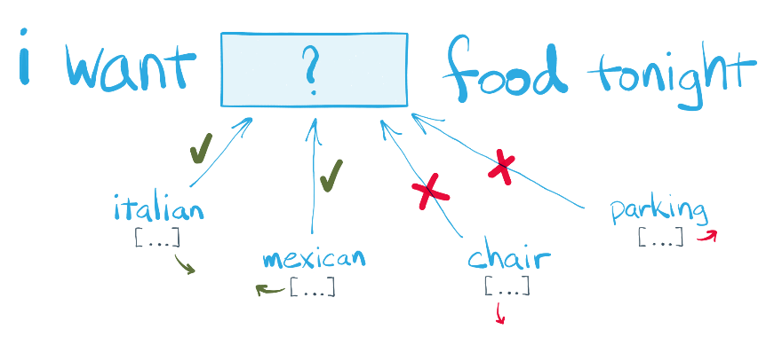

# 6.1.2. 	단어 임베딩

이글은 다음 싸이트를 참조하여 작성되었습니다.

**참고** **:**

* [http://blog.theeluwin.kr/post/146591096133/%ED%95%9C%EA%B5%AD%EC%96%B4-word2vec](http://blog.theeluwin.kr/post/146591096133/%ED%95%9C%EA%B5%AD%EC%96%B4-word2vec)
* [https://dreamgonfly.github.io/machine/learning,/natural/language/processing/2017/08/16/word2vec\_explained.html](https://dreamgonfly.github.io/machine/learning,/natural/language/processing/2017/08/16/word2vec_explained.html)

NLP\(Natural Language Processing, 자연어 처리\)는 ‘컴퓨터가 인간이 사용하는 언어를 이해하고, 분석할 수 있게 하는 분야’ 를 총칭하는 말입니다. 그러나 얼핏 생각했을 때 컴퓨터가 이를 이해할 수 있도록 언어를 변환하는 것은 참 어려운 일일 것입니다. 컴퓨터에게 ‘사과’와 ‘초콜릿’ 이라는 두 단어를 보여준다고 컴퓨터가 두 단어의 개념적인 차이를 이해할 수 있을까요? 컴퓨터는 단순히 두 단어를 유니코드의 집합으로만 생각할 것입니다.

2013년 구글에서 개발한 Word2Vec이라는 방법론이 있습니다. 이름 그대로 단어\(Word\)를 벡터\(Vector\)로 바꿔주는 방법입니다. word2vec은 CBOW 방식과 Skip-Gram 방식의 단어 임베딩을 구현한 C++ 라이브러리로 구글에 있던 Mikolov 등이 개발하였습니다. 파이썬에서는 gensim이라는 패키지에 Word2Vec이라는 클래스로 구현되어 있습니다.

Word2Vec은 간단하게 말해서 단어들을 고정된 차원의 벡터스페이스에 유의미하게 배치해주는 단어 임베딩\(word embedding\) 알고리즘 중 하나입니다.

단어를 벡터로 바꿀 때, 좀 더 똑똑하게 바꿔서 벡터에 단어의 의미를 담을 수 있다면 어떨까? 비슷한 의미의 단어들은 비슷한 벡터로 표현이 된다면? 더 나아가 단어와 단어 간의 관계가 벡터를 통해서 드러날 수 있다면? 예를 들면 ‘왕’과 ‘여왕’의 관계가 ‘남자’와 ‘여자’의 관계라는 것을 벡터를 통해 알아낼 수 있다면, 유용하게 쓸 수 있을 것입니다.

이렇게 단어를 벡터로 바꾸는 모델을 단어 임베딩 모델\(word embedding model\)이라고 부릅니다. word2vec은 단어 임베딩 모델들 중 대표적인 모델입니다.

word2vec의 핵심적인 아이디어는 “친구를 보면 그 사람을 안다” 또는 “단어의 주변을 보면 그 단어를 안다” 입니다.

잠시 퀴즈를 하나 풀어보자. 다음 빈칸에 들어갈 수 있는 단어는 무엇이 있을까요?

italian, mexican 등의 단어를 떠올릴 수 있습니다. 하지만 chair, parking 이런 말들은 들어가기 어려울 것입니다.

단어의 주위만 보았는데도 어떤 단어가 적합하고 어떤 단어가 부적합한지가 어느정도 드러납니다. 이 빈칸에 들어갈 수 있는 단어들은 서로 비슷한 맥락을 갖는 단어들, 즉 서로 비슷한 단어들입니다. 단어의 주변을 보면 그 단어를 알 수 있기 때문에, 단어의 주변이 비슷하면 비슷한 단어라는 말이 됩니다.

이렇게 유사어를 찾아주는 것이 Word2Vec 의 기능입니다.

