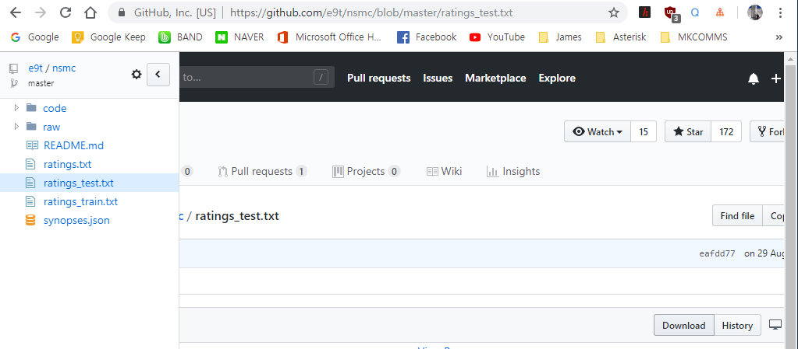

# 6.1.3. 	Word2Vec 모델 만들기

**다음** **예제는** 네이버 영화 리뷰를 정리해둔 Naver sentiment movie corpus v1.0\([https://github.com/e9t/nsmc](https://github.com/e9t/nsmc)\) **를** **사용하여** **Word Embedding Model \(Word2Vec\)을** **빌드하는** **것입니다.**

일단 다음 명령으로 genism 라이브러리를 설치합니다. NLTK는 자연어 처리를 위해 광범위하게 쓰이는 Python library입니다.

```text
(onebook) > pip install lxml
(onebook) > pip install utils
(onebook) > pip install paramiko
(onebook) > pip install nltk
(onebook) > pip install genism
```

**그** **다음은** [https://github.com/e9t/nsmc](https://github.com/e9t/nsmc) 에서 Corpus를 다운로드 합니다.

Naver sentiment movie corpus는 3개의 파일로 되어 있습니다.

* ratings.txt: All 200K reviews
* ratings\_test.txt: 50K reviews held out for testing
* ratings\_train.txt: 150K reviews for training

각 파일에 있는 Column 은 &lt;영화 아이디, 영화 평, 영화 평점&gt; 입니다.

위의 세개의 파일을 raw형태로 다운로드 합니다.



Onebook 가상환경 하단에 NLP라는 폴더를 만들고 다운받은 파일을 이동합니다. "NaverMovieWord2Vec.py" 파이썬 파일을 새로 만들고 프로그래밍을 시작하겠습니다.

일단 저장된 파일을 csv를 사용해서 읽겠습니다. CSV란 Comma-separated values의 약자로서 CSV 파일은 각 라인의 컬럼들이 콤마로 분리된 텍스트 파일 포맷입니다. CSV 파일을 읽기 위해서는 먼저 파이썬에 기본 내장된 csv 모듈을 import 합니다. 다음 .csv 파일을 오픈하고 파일객체를 csv.reader\(파일객체\) 에 넣으면 됩니다. csv.reader\(\) 함수는 Iterator 타입인 reader 객체를 리턴하므로 for 루프를 돌며 한 라인씩 가져올 수 있습니다. CSV 파일과 비슷하지만, 콤마 대신 Tab으로 컬럼을 분리하는 파일포맷을 TSV 파일이라 합니다. TSV 파일은 컬럼 delimiter만 차이가 나므로, csv 모듈의 reader\(\) 혹은 writer\(\) 함수에서 delimiter='\t' 옵션만 지정해 주면 나머지는 CSV와 동일합니다. Naver sentiment movie corpus는 탭으로 구분되어 있으므로 TSV를 읽는 방식으로 읽습니다.

```python
import csv

 f = open('ratings_train.txt', 'r', encoding='utf-8')
 rdr = csv.reader(f, delimiter='\t')
 r = list(rdr)
 print("Id=%s : Name=%s" % (r[0][0], r[0][1]))
 print("Id=%s : Name=%s" % (r[1][0], r[1][1]))
 print("Id=%s : Name=%s" % (r[2][0], r[2][1]))

 f.close()
```

위의 코드를 수행하면 다음과 같은 결과를 출력합니다.

```text
Id=id : Name=document
Id=9976970 : Name=아 더빙.. 진짜 짜증나네요 목소리
Id=3819312 : Name=흠...포스터보고 초딩영화줄....오버연기조차 가볍지 않구나
```

이제 본격적으로 형태소 분석 코드를 넣어 보겠습니다. 여기서 'konlpy'의 여러 품사 태깅 클래스 중 'Twitter'를 사용했습니다. Konlpy의 Twitter은 Okt로 변경되었습니다.

실제 형태소를 분석한 결과는 다음과 같습니다.

```text
[('재미', 'Noun'), ('잇다', 'Verb'), ('매우', 'Noun'), ('~~', 'Punctuation')]
[('진짜', 'Noun'), ('자다', 'Verb'), ('만들다', 'Verb'), ('수작', 'Noun')]
[('제발', 'Noun'), ('2', 'Number'), ('좀', 'Noun'), ('찍다', 'Verb'), ('.', 'Punctuation'), ('현기증', 'Noun'), ('나다', 'Verb'), ('말', 'Noun'), ('이에요', 'Josa')]
[('너무나도', 'Adverb'), ('따뜻하다', 'Adjective'), (',', 'Punctuation'), ('마음', 'Noun'), ('이', 'Josa'), ('따뜻하다', 'Adjective'), ('...', 'Punctuation'), ('한번', 'Noun'), ('쯤', 'Suffix'), ('자신', 'Noun'), ('을', 'Josa'), ('되돌아보다', 'Verb'), ('만들다', 'Verb'), ('영화', 'Noun')]
```

여기에서 “Josa”, “Eomi”, “'Punctuation”는 제외하고 처리해야 합니다. 전체 소스는 다음과 같습니다.

```python
 import csv
 from konlpy.tag import Okt
 from gensim.models import word2vec

 #네이버 영화 코퍼스를 읽는다.
 f = open('ratings_train.txt', 'r', encoding='utf-8')
 rdr = csv.reader(f, delimiter='\t')
 rdw = list(rdr)
 f.close()

 #트위터 형태소 분석기를 로드한다. Twiter가 KoNLPy v0.4.5 부터 Okt로 변경 되었다.
 twitter = Okt()

 #텍스트를 한줄씩 처리합니다.
 result = []
 for line in rdw:
     #형태소 분석하기, 단어 기본형 사용
     malist = twitter.pos( line[1], norm=True, stem=True)
     r = []
     for word in malist:
         #Josa”, “Eomi”, “'Punctuation” 는 제외하고 처리
         if not word[1] in ["Josa","Eomi","Punctuation"]:
             r.append(word[0])
     #형태소 사이에 공백 " "  을 넣습니다. 그리고 양쪽 공백을 지웁니다.
     rl = (" ".join(r)).strip()
     result.append(rl)
     #print(rl)

 #형태소들을 별도의 파일로 저장 합니다.
 with open("NaverMovie.nlp",'w', encoding='utf-8') as fp:
     fp.write("\n".join(result))

 #Word2Vec 모델 만들기
 wData = word2vec.LineSentence("NaverMovie.nlp")
 wModel =word2vec.Word2Vec(wData, size=200, window=10, hs=1, min_count=2, sg=1)
 wModel.save("NaverMovie.model")
 print("Word2Vec Modeling finished")
```

위의 코드를 실행하면 종료 할 때까지 많은 시간이 걸립니다. 결과는 NaverMovie.model 파일입니다. 어미, 조사, 구두점을 제외하고 동사와 형용사는 기본형으로 학습하도록 입력 텍스트를 만들었습니다. 공백으로 구분된 텍스트 파일을 Word2Vec에 전달하고 생성된 모델을 save\(\)로 저장했습니다.

이제 위에서 생성한 모델을 사용하여 단어 유사도를 확인해 보겠습니다.

다시 NaverMovieModelTest.py 라는 파일을 만들어 다음의 코드를 입력 해 봅니다.

```python
from gensim.models import word2vec

model = word2vec.Word2Vec.load("NaverMovie.model")

print(model.most_similar(positive=["재미"]))

print(model.most_similar(positive=["최고"]))
```

위 코드의 수행 결과는 다음과 같습니다.

“재미”라는 단어와 유사한 단어들을 벡터로 나타낸 것입니다.

\[\('없슴', 0.6063779592514038\), \('나용', 0.6040781736373901\), \('지렁이', 0.5945030450820923\), \('칙스', 0.5877454280853271\), \('오랬', 0.5862023830413818\), \('원도', 0.5712456703186035\), \('잼', 0.5703416466712952\), \('무것', 0.5685503482818604\), \('푸시', 0.5684186816215515\), \('유익', 0.5595628023147583\)\]

“최고”라는 단어와 유사한 단어들의 벡터는 다음과 같습니다.

\[\('꼽을', 0.6920815110206604\), \('꼽는', 0.6835036873817444\), \('최고다', 0.6749817132949829\), \('단연', 0.6692216396331787\), \('손꼽다', 0.6552967429161072\), \('으뜸', 0.6476656198501587\), \('하이스쿨', 0.6261676549911499\), \('정치드라마', 0.6205614805221558\), \('꼽겠다', 0.6203451156616211\), \('였슴', 0.6191103458404541\)\]

