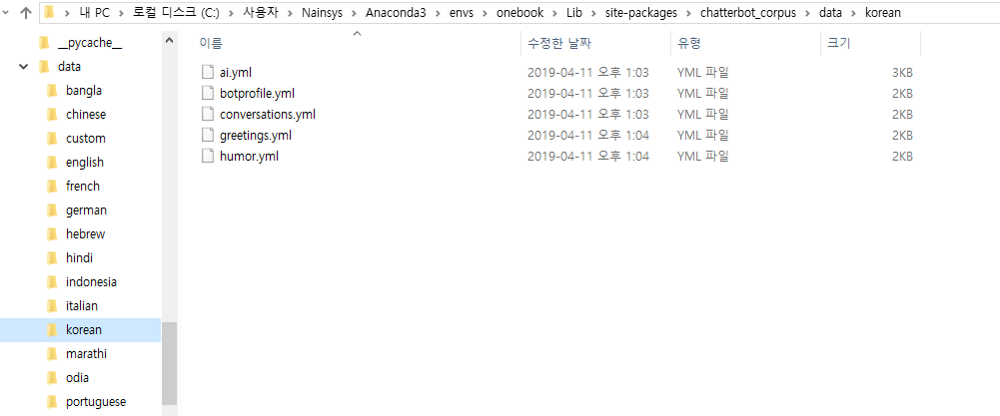
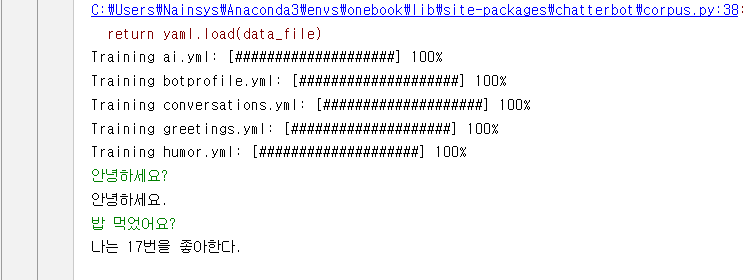

# 6.2.1. 	ChatterBot 설치 및 기본동작

이 문서는 [https://chatterbot.readthedocs.io/en/stable/index.html](https://chatterbot.readthedocs.io/en/stable/index.html) 를 참조하여 작성 되었습니다.

ChatterBot는 pip 를 사용하여 설치 할 수 있습니다.

```text
(onebook) > pip install chatterbot
(onebook) > pip install --upgrade chatterbot_corpus nor
(onebook) > pip install --upgrade chatterbot
```

ChatterBot 설치가 완료되면 다음의 코드로 ChatterBot를 테스트 해 봅니다.

```python
from chatterbot import ChatBot
from chatterbot.trainers import ListTrainer

conversation = [
     "Hello",
     "Hi there!",
     "How are you doing?",
     "I'm doing great.",
     "That is good to hear",
     "Thank you.",
     "You're welcome.",
     "Hi, can I help you?",
     "Sure, I'd like to book a flight to Iceland.",
     "Your flight has been booked."
 ]

 # Create a new chat bot named Charlie
 chatbot = ChatBot('Charlie')
 # Create a new Trainer
 trainer = ListTrainer(chatbot)

 trainer.train(conversation)
 # Get a response to the input text 'Good morning.'
 response = chatbot.get_response("Good morning!")
 print(response)
 # Get a response to the input text 'I would like to book a flight.'
 response = chatbot.get_response('I would like to book a flight.')
 print(response)
```

위의 코드를 수행하면 주어진 문장으로 챗봇을 학습시킨 후 “Good Morning”이라는 대화의 응답으로 ‘You're welcome.’이 출력 되었습니다.

이제 한글로 대화하는 챗봇을 만들어 보겠습니다.

먼저 말뭉치\(코퍼스\)를 준비해야 합니다. 다음 주소에서 korean yml 파일들을 모두 다운로드 받습니다.

[https://github.com/gunthercox/chatterbot-corpus](https://github.com/gunthercox/chatterbot-corpus)

C:\Users\사용자명\Anaconda3\envs\onebook\Lib\site-packages\chatterbot\_corpus\data\korean 폴더를 만들고 다운받은 파일들을 모두 복사해 줍니다.



위에서 제공하는 코퍼스가 부족하여 많은 학습을 시킬수는 없습니다. 실망스럽겠지만 더 많은 코퍼스를 제공하여 학습시킨다면 더욱 똑똑한 챗봇을 만들 수 있습니다.

다음 예제 프로그램은 터미널에 한글로 타이핑하여 챗봇과 통신할 수있는 간단한 터미널 클라이언트를 만드는 방법을 보여줍니다.

```python
 from chatterbot import ChatBot
 from chatterbot.trainers import ChatterBotCorpusTrainer

 # Create a new chat bot named Charlie
 chatbot = ChatBot('Charlie')
 # Create a new Trainer
 trainer = ChatterBotCorpusTrainer(chatbot)

 trainer.train(
     "chatterbot.corpus.korean"
 )

 # The following loop will execute each time the user enters input
 while True:
     try:
         user_input = input()

         bot_response = chatbot.get_response(user_input)

         print(bot_response)

     # Press ctrl-c or ctrl-d on the keyboard to exit
     except (KeyboardInterrupt, EOFError, SystemExit):
         break
```

결과는 다음과 같습니다.




