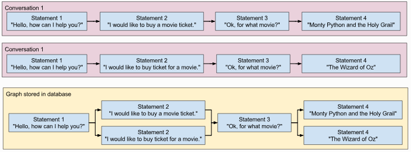

# 6.2.2. 	ChatterBot 사용법

ChatterBot에는 챗봇 학습 과정을 단순화하는데 도움이되는 도구가 포함되어 있습니다. 챗봇 트레이너에게 데이터 세트가 제공되면 챗봇의 지식에 필요한 항목이 만들어져 질문에 대해 더 똑똑하게 응답할 수 있습니다.



ChatterBot의 처리 과정은

Input → PreProcessor → Logic Adapter → Response

순서로 진행됩니다.

ChatterBot의 preprocessors는 채팅 엔진이 Logic Adapter에 의해 처리되기 전에 챗봇이 받는 입력문을 수정하는 간단한 함수입니다.

다음은 preprocessor를 설정하는 방법의 예입니다. preprocessors매개 변수는 선행 처리기로 가져오는 경로의 문자열 목록이어야합니다.

```python
chatbot = ChatBot(
    'Bob the Bot',
    preprocessors=[
        'chatterbot.preprocessors.clean_whitespace'
    ]
)
```

ChatterBot에는 몇 가지 기본 제공 preprocessor가 함께 제공됩니다.

입력 텍스트에서 연속 공백 문자를 제거하는 preprocessor

**`chatterbot.preprocessors.clean_whitespace`\(**_**statement**_**\)**

이스케이프 처리된 html 문자를 이스케이프 처리되지 않은 html 문자로 변환합니다. 예: "& lt; b & gt;"는 "&lt;b&gt;"이 됩니다.

**`chatterbot.preprocessors.unescape_html`\(**_**statement**_**\)**

유니 코드 문자를 ASCII 문자로 변환합니다. 예를 들면 : "på fédéral"은 "pa federal"이됩니다.

**`chatterbot.preprocessors.convert_to_ascii`\(**_**statement**_**\)**

Logic 어댑터는 ChatterBot이 주어진 입력문에 대한 응답을 선택하는 방법에 대한 논리를 결정합니다.

다음과 같이 사용합니다.

```python
chatbot = ChatBot(
    "My ChatterBot",
    logic_adapters=[
        "chatterbot.logic.BestMatch"
    ]
)
```

Best Match Adapter, Time Logic Adapter, Mathematical Evaluation Adapter, Specific Response Adapter 등이 있습니다.

Storage 어댑터는 ChatterBot이 다른 스토리지에 연결할 수있는 인터페이스를 제공합니다.

ChatterBot은 여러 개의 동시 대화를 수행하는 기능을 지원합니다. 여러 개의 동시 대화를 지원한다는 것은 챗봇이 여러 사람과 동시에 여러 대화를 가질 수 있음을 의미합니다.

두 개의 ChatBot 인스턴스가 생성되면 각각은 서로 분리된 대화를 갖게됩니다.

ChatterBot을 학습시키기 위해서는 말뭉치를 제공해야 합니다. ChatterBot에서 사용하는 코퍼스는 다음과 같은 YAML Data Format으로 만들어야 합니다.

```text
categories:
- english
- greetings
conversations:
- - Hello
  - Hi
- - Hello
  - Hi, how are you?
  - I am doing well.
- - Good day to you sir!
  - Why thank you.
- - Hi, How is it going?
  - It's going good, your self?
  - Mighty fine, thank you.
```

ChatterBot의 training 모듈은 챗봇의 데이터베이스 내용을 다른 챗봇을 훈련하는데 사용할 수 있는 교육 자료로 내보낼 수있는 방법을 제공합니다.

```python
chatbot = ChatBot('Export Example Bot')
chatbot.trainer.export_for_training('./export.yml')
```

```python
from chatterbot import ChatBot
from chatterbot.trainers import ChatterBotCorpusTrainer
'''
This is an example showing how to create an export file from
an existing chat bot that can then be used to train other bots.
'''
chatbot = ChatBot('Export Example Bot')
# First, lets train our bot with some data
trainer = ChatterBotCorpusTrainer(chatbot)
trainer.train('chatterbot.corpus.english')
# Now we can export the data to a file
trainer.export_for_training('./my_export.json')
```

ChatterBot은 Django의 ORM과의 통합을 직접 지원합니다. Django 응용 프로그램에서 ChatterBot을 사용하여 대화 페이지와 endpoint를 만드는 것은 비교적 쉽습니다.

