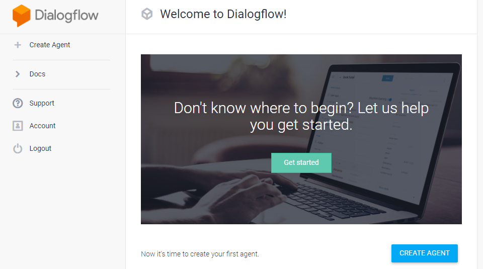
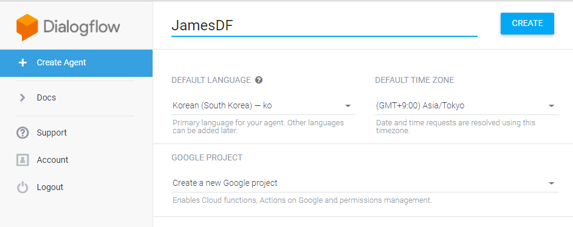
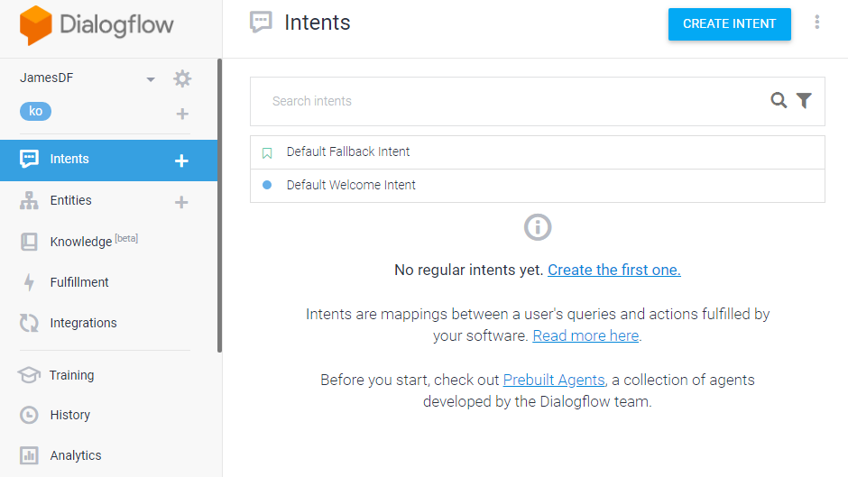

# 6.3.1. 	DialogFlow Standard 버전 챗봇 만들기

Google 계정 ID 만 있으면 dialogflow로 접속하여 바로 생성 가능합니다.

다음 두 가지 Dialogflow 버전 중 하나를 선택할 수 있습니다.

* Dialogflow Standard 버전은 dialogflow.com에서 무료로 사용할 수 있습니다. 이 버전은 Dialogflow Enterprise 버전과 동일한 기능을 제공하지만 사용 할당량에 따라 상호작용이 제한되고 커뮤니티와 이메일을 통한 지원이 제공됩니다. 이 버전은 대화 인터페이스를 빌드하려는 중소기업 또는 Dialogflow를 실험해 보려는 사용자에게 적합합니다.
* Dialogflow Enterprise 버전은 Google Cloud Platform\(GCP\)의 일부로 사용할 수 있으며 대용량 사용 할당량, Google Cloud를 통한 지원이 제공됩니다. Dialogflow Enterprise 버전은 사용량만큼 요금을 지불하는 방식의 프리미엄 서비스입니다. 이 버전은 변화하는 사용자 수요를 지원하도록 쉽게 확장할 수 있는 엔터프라이즈급 서비스가 필요한 기업에 적합합니다.

일단 Standard 버전으로 만들어 보겠습니다. 기본 설정을 완료하시면 이렇게 콘솔의 시작화면이 나옵니다. 오른쪽 상단의 ‘CREATE AGENT’ 버튼을 눌러 앱을 생성합니다.

agent의 이름과 언어, TimeZone, Project 등의 설정을 마친 뒤 CREATE합니다.

CREATE 버튼을 누르면 약간의 시간이 흐른 후 다음과 같은 화면이 나타납니다.

왼쪽 Intents, Entities, Fulfillment, Integrations 만 설정하면 챗봇을 만들수 있습니다.

